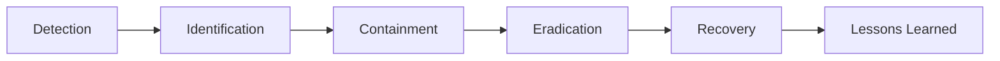

# 🚨 TriVerse ERP - Incident Response Plan

**Version:** 1.0  
**Effective Date:** February 15, 2026  
**Last Updated:** February 15, 2026  
**Owner:** Chief Technology Officer  
**Classification:** Internal - Confidential

---

## 📋 TABLE OF CONTENTS

1. [Incident Classification](#incident-classification)
2. [Breach Handling Steps](#breach-handling-steps)
3. [Notification Timeline](#notification-timeline)
4. [Customer Communication](#customer-communication)
5. [Post-Incident Activities](#post-incident-activities)
6. [Incident Response Team](#incident-response-team)
7. [Appendices](#appendices)

---

## 🎯 INCIDENT CLASSIFICATION

### 1.1 Incident Definition

**Security Incident:** Any event that compromises the confidentiality, integrity, or availability of TriVerse ERP systems or customer data.

**Incident Categories:**

```
┌─────────────────────────────────────────┐
│  CATEGORY 1: DATA BREACH                │
│  - Unauthorized data access/exfiltration│
│  - Customer data exposed                │
│  - PII/financial data compromised       │
│  - Severity: CRITICAL (P0)              │
└─────────────────────────────────────────┘

┌─────────────────────────────────────────┐
│  CATEGORY 2: SYSTEM COMPROMISE          │
│  - Ransomware, malware infection        │
│  - Unauthorized system access           │
│  - Account takeover (privilege)         │
│  - Severity: CRITICAL (P0) or HIGH (P1) │
└─────────────────────────────────────────┘

┌─────────────────────────────────────────┐
│  CATEGORY 3: SERVICE DISRUPTION         │
│  - DDoS attack                          │
│  - System outage (security-caused)      │
│  - Data corruption/deletion             │
│  - Severity: HIGH (P1)                  │
└─────────────────────────────────────────┘

┌─────────────────────────────────────────┐
│  CATEGORY 4: SECURITY VULNERABILITY     │
│  - Critical vulnerability discovered    │
│  - Zero-day exploit                     │
│  - Misconfiguration exposing data       │
│  - Severity: HIGH (P1) or MEDIUM (P2)   │
└─────────────────────────────────────────┘

┌─────────────────────────────────────────┐
│  CATEGORY 5: POLICY VIOLATION           │
│  - Insider threat activity              │
│  - Unauthorized data access (internal)  │
│  - Security policy violation            │
│  - Severity: MEDIUM (P2) or LOW (P3)    │
└─────────────────────────────────────────┘
```

### 1.2 Severity Levels

**P0 - CRITICAL (Response: Immediate)**

**Criteria:**
- Customer data breached (confirmed exfiltration)
- Ransomware with data encryption
- Complete system compromise
- Regulatory reportable incident (GDPR, SOC 2)
- Revenue impact > $100,000

**Response Timeline:**
- **Detection to Acknowledgment:** 15 minutes
- **Initial Assessment:** 30 minutes
- **Containment Start:** 1 hour
- **Executive Notification:** 1 hour
- **Customer Notification:** 24-72 hours (per regulation)

**P1 - HIGH (Response: Urgent)**

**Criteria:**
- Unauthorized access attempt (successful)
- Critical vulnerability actively exploited
- DDoS affecting service availability
- Data integrity compromise
- Privileged account compromised

**Response Timeline:**
- **Detection to Acknowledgment:** 1 hour
- **Initial Assessment:** 4 hours
- **Containment Start:** 8 hours
- **Executive Notification:** 4 hours

**P2 - MEDIUM (Response: Priority)**

**Criteria:**
- Security misconfiguration discovered
- Brute force attack (unsuccessful)
- Suspicious activity (investigation needed)
- Non-critical vulnerability
- Policy violation (minor)

**Response Timeline:**
- **Detection to Acknowledgment:** 4 hours
- **Initial Assessment:** 24 hours
- **Remediation Start:** 48 hours

**P3 - LOW (Response: Standard)**

**Criteria:**
- Security awareness event (phishing email received)
- False positive alert (confirmed)
- Minor policy violation
- Low-risk vulnerability

**Response Timeline:**
- **Detection to Acknowledgment:** 24 hours
- **Assessment:** As resources available
- **Remediation:** Next maintenance window

---

## 🛡️ BREACH HANDLING STEPS

### 2.1 Incident Response Phases



### Phase 1: DETECTION (Continuous)

**Detection Methods:**

```
Automated Monitoring:
  ✅ SIEM alerts (ELK Stack, Splunk)
  ✅ IDS/IPS (Intrusion Detection/Prevention)
  ✅ Log analysis (failed login patterns)
  ✅ Anomaly detection (unusual data access)
  ✅ Vulnerability scanners (weekly scans)
  
Human Detection:
  ✅ User reports (suspicious emails, behavior)
  ✅ Security team review (audit logs)
  ✅ Penetration test findings
  ✅ Third-party security researcher disclosure
```

**Alert Triggers:**

```yaml
# Example SIEM Alert Rules

- name: "Brute Force Attack Detected"
  condition: failed_login_attempts > 10 within 5 minutes
  severity: P2
  action: Auto-block IP, notify security team

- name: "Unusual Data Export Volume"
  condition: data_export_size > 10GB by single user
  severity: P1
  action: Suspend account, notify CISO

- name: "Admin Account Access from New Location"
  condition: admin_login AND new_country
  severity: P1
  action: Require re-authentication, notify security

- name: "Database Direct Access Attempted"
  condition: sql_query_from_external_ip
  severity: P0
  action: Block immediately, incident alert

- name: "Encryption Key Access"
  condition: vault_secret_accessed AND not_app_service
  severity: P0
  action: Audit trail, immediate investigation
```

**24/7 Monitoring:**
- **Weekdays (9am-6pm):** Security team on-site
- **Evenings/Weekends:** On-call rotation (PagerDuty)
- **Critical Alerts:** SMS + Phone call escalation
- **Response Time:** < 15 minutes for P0, < 1 hour for P1

### Phase 2: IDENTIFICATION (15 min - 4 hours)

**Incident Commander Responsibilities:**

```
Step 1: Verify Incident (15-30 minutes)
  ☐ Review alert details
  ☐ Check for false positive
  ☐ Gather initial evidence (logs, screenshots)
  ☐ Determine incident category and severity
  ☐ Document findings in incident ticket

Step 2: Assemble Incident Response Team (30-60 minutes)
  ☐ Page on-call responders (see escalation matrix)
  ☐ Create dedicated Slack channel (#incident-YYYYMMDD-HH)
  ☐ Schedule war room (physical or Zoom)
  ☐ Notify CTO (P0/P1 incidents)

Step 3: Initial Scope Assessment (1-4 hours)
  ☐ What systems affected?
  ☐ What data potentially compromised?
  ☐ How many users/customers impacted?
  ☐ When did breach occur? (look back 90 days)
  ☐ Attack vector identified?
  ☐ Is attacker still active?
```

**Evidence Collection:**

```bash
# Immediate evidence preservation

# 1. Capture system snapshot
aws ec2 create-snapshot --volume-id vol-xxxxx --description "Incident-2026-02-15"

# 2. Export recent logs (last 24 hours)
aws logs tail /aws/application/triverse-erp --since 24h > incident_logs_$(date +%Y%m%d).log

# 3. Database audit log export
psql -d triverse_erp -c \
  "COPY (SELECT * FROM audit_logs WHERE created_at > NOW() - INTERVAL '24 hours') TO STDOUT CSV" \
  > audit_trail_$(date +%Y%m%d).csv

# 4. Network traffic capture (if attack ongoing)
tcpdump -i eth0 -w incident_traffic_$(date +%Y%m%d).pcap

# 5. Memory dump (compromised server)
sudo dd if=/dev/mem of=/mnt/forensics/memory_dump_$(date +%Y%m%d).bin

# Store all evidence in secure, write-once location
aws s3 cp --recursive ./evidence/ s3://triverse-incident-evidence/2026-02-15/ \
  --storage-class GLACIER_IR --sse AES256
```

**Chain of Custody Form:**

```
EVIDENCE COLLECTION LOG

Incident ID: INC-2026-02-15-001
Date/Time: February 15, 2026, 14:30 UTC
Collected By: Veeraj Matnale, CTO
Witness: [DevOps Engineer Name]

Evidence Items:
  1. Server snapshot: snap-0123456789 (AWS)
  2. Database logs: audit_trail_20260215.csv (15.2 MB)
  3. Application logs: incident_logs_20260215.log (42.1 MB)
  4. Network capture: incident_traffic_20260215.pcap (103 MB)

Storage Location: s3://triverse-incident-evidence/2026-02-15/
Access Restricted To: Incident Response Team + Legal
Integrity Hash (SHA-256): a3d5f9e8c2b1... [recorded]

This evidence may be used for legal proceedings and must not be altered.
```

### Phase 3: CONTAINMENT (1-8 hours)

**Short-Term Containment (Immediate):**

```
GOAL: Stop the bleeding, prevent further damage

Actions (execute in parallel):

☐ ISOLATE compromised systems
  - Disconnect from network (not power off - preserves RAM)
  - Block IP addresses at firewall
  - Revoke compromised credentials

☐ PRESERVE evidence
  - System snapshots before any changes
  - Log exports before manipulation
  - Network traffic captures

☐ PREVENT lateral movement
  - Segment network (close inter-zone traffic)
  - Disable compromised accounts
  - Force password reset for privileged accounts

☐ COMMUNICATE internally
  - War room status updates every 30 minutes
  - Executive summary every 2 hours
  - No external communication yet (legal review first)
```

**Example: Ransomware Containment**

```bash
# IMMEDIATE ACTIONS (execute within 15 minutes)

# 1. Isolate infected servers
aws ec2 modify-instance-attribute --instance-id i-xxxxx \
  --groups sg-isolated-quarantine

# 2. Snapshot before shutdown (forensics)
aws ec2 create-snapshot --volume-id vol-xxxxx \
  --description "Ransomware-incident-pre-shutdown"

# 3. Stop infected instances (prevent spread)
aws ec2 stop-instances --instance-ids i-xxxxx i-yyyyy

# 4. Block attacker IPs at WAF
aws wafv2 update-ip-set --id xxx --addresses 192.0.2.44/32 --scope REGIONAL

# 5. Revoke all API keys (prevent data exfiltration)
psql -d triverse_erp -c "UPDATE api_keys SET revoked = TRUE, revoked_at = NOW()"

# 6. Force logout all users (clear sessions)
redis-cli FLUSHDB  # Clear session cache

# 7. Enable read-only mode (prevent data destruction)
psql -d triverse_erp -c "ALTER DATABASE triverse_erp SET default_transaction_read_only = on"

# 8. Notify team via PagerDuty
curl -X POST https://events.pagerduty.com/v2/enqueue \
  -H 'Authorization: Token token=YOUR_TOKEN' \
  -d '{"event_action":"trigger", "payload":{"summary":"CRITICAL: Ransomware detected"}}'
```

**Long-Term Containment (1-8 hours):**

```
GOAL: Restore minimal safe operations while investigation continues

☐ REBUILD clean environment
  - Launch new application servers from clean images
  - Restore database from last known-good backup
  - Implement additional monitoring

☐ STRENGTHEN defenses
  - Apply emergency patches
  - Add firewall rules (whitelist only)
  - Enable enhanced logging

☐ VERIFY restoration point
  - Confirm backup not compromised
  - Check backup date (before attack started)
  - Test restored system in isolated environment
```

### Phase 4: ERADICATION (4-48 hours)

**Remove Threat Completely:**

```
☐ IDENTIFY root cause
  - Vulnerability exploited (patch available?)
  - Credentials stolen (how? phishing? brute force?)
  - Insider threat (who had access?)
  - Third-party compromise (vendor security?)

☐ REMOVE all attacker access
  - Delete backdoor accounts
  - Close exploited vulnerabilities
  - Rotate ALL credentials (assume compromise)
  - Rebuild compromised systems (do not "clean")

☐ PATCH vulnerabilities
  - Apply security updates
  - Fix misconfigurations
  - Update firewall rules
  - Strengthen authentication (enforce MFA)

☐ VERIFY removal
  - Re-scan for malware (multiple tools)
  - Review all admin accounts (remove unknown)
  - Check for persistence mechanisms (scheduled tasks, etc.)
  - Monitor for attacker return (48-hour watch)
```

**Key Rotation Checklist:**

```bash
# After containment, rotate ALL secrets

# 1. Database passwords
psql -d triverse_erp -c "ALTER USER postgres PASSWORD 'NEW_SECURE_PASSWORD'"

# 2. JWT secrets (force re-login for all users)
# Update .env file
JWT_SECRET="$(openssl rand -hex 32)"
JWT_REFRESH_SECRET="$(openssl rand -hex 32)"

# 3. Encryption keys (complex - requires data re-encryption)
ENCRYPTION_KEY="$(openssl rand -hex 32)"
# Then run: node scripts/re-encrypt-data.js

# 4. API keys for third-party services
# Manually regenerate in:
# - AWS (IAM → Access Keys → Rotate)
# - Stripe (Dashboard → Developers → API Keys → Roll)
# - SendGrid (Settings → API Keys → Create)

# 5. SSL certificates (if private key compromised)
certbot certonly --manual --force-renewal -d triverse.com

# 6. SSH keys for server access
ssh-keygen -t ed25519 -C "incident-recovery-$(date +%Y%m%d)"
# Deploy to all servers, revoke old keys

# 7. Vault unseal keys (if Vault compromised)
vault operator rekey -init -key-shares=5 -key-threshold=3
```

### Phase 5: RECOVERY (4-72 hours)

**Restore Normal Operations:**

```
☐ RESTORE services incrementally
  - Start with internal tools (test safety)
  - Then read-only public access (limited risk)
  - Finally full service (after verification)

☐ MONITOR intensively
  - 24/7 watch for 48-72 hours
  - Heightened alerting sensitivity
  - Manual log review (automated + human eyes)

☐ VALIDATE data integrity
  - Database consistency checks
  - File integrity monitoring (FIM)
  - Financial reconciliation (no unauthorized transactions)

☐ COMMUNICATE restoration
  - Internal: Services restored, remain vigilant
  - Customers: Notification if breach confirmed (see Section 4)
```

**Restoration Checklist:**

```
Hour 0-4: Internal Systems
  ☐ Development environment (isolated)
  ☐ Staging environment (limited access)
  ☐ Internal admin panel (VPN only)
  
Hour 4-24: Limited Production
  ☐ Read-only mode (users can view, not edit)
  ☐ Critical modules only (finance, payroll)
  ☐ Monitor for anomalies
  
Hour 24-48: Full Restoration (if safe)
  ☐ All features restored
  ☐ Normal operation resumed
  ☐ Enhanced monitoring continues for 30 days
  
Hour 48-72: Validation
  ☐ Security audit passed
  ☐ No attacker activity detected
  ☐ Incident formally closed
```

### Phase 6: LESSONS LEARNED (1-2 weeks post-incident)

**Post-Incident Review Meeting:**

```
Attendees:
  - Incident Response Team
  - CTO, CEO
  - Affected department heads
  - External auditor (if applicable)

Agenda:
  1. Incident timeline review
  2. What went well?
  3. What went poorly?
  4. Root cause analysis (5 Whys)
  5. Action items to prevent recurrence
  6. Policy/procedure updates needed

Deliverable:
  - Post-Incident Report (confidential)
  - Action items with owners and deadlines
  - Updated incident response runbook
```

**Root Cause Analysis (5 Whys):**

```
Example: Database exposed on public internet

Why was customer data accessed by attacker?
→ Database was accessible from the internet.

Why was the database accessible from the internet?
→ Security group rules allowed 0.0.0.0/0 for PostgreSQL port.

Why were those security group rules configured that way?
→ Developer opened it temporarily for debugging, forgot to close.

Why didn't we catch this misconfiguration?
→ No automated security group audit/remediation.

Why don't we have automated security audits?
→ IaC (Infrastructure as Code) not fully implemented; manual changes allowed.

ROOT CAUSE: Manual infrastructure changes without approval or audit.

SOLUTION: 
  1. Implement IaC (Terraform) for all infrastructure (no manual changes)
  2. PR approval required for infrastructure changes
  3. Automated daily security group audit (AWS Config)
  4. Alert on any 0.0.0.0/0 rules (immediate notification)
```

---

## ⏱️ NOTIFICATION TIMELINE

### 3.1 Regulatory Requirements

**GDPR (EU Customers):**
```
Timeline: 72 hours from breach discovery to notification

Notification to: Data Protection Authority (DPA)
  - Country: Where company is established (Ireland for EU ops)
  - Method: Online form on DPA website
  - Content: Nature of breach, categories of data, affected individuals count
  
Notification to: Affected Individuals
  - When: "Without undue delay" if high risk to their rights
  - Method: Email (or public notice if contact impossible)
  - Content: What happened, what data, what we're doing, what they should do

Penalties for non-compliance:
  - Up to €10 million OR 2% of global annual revenue (whichever higher)
```

**California CCPA (US Customers):**
```
Timeline: "Without reasonable delay" (interpreted as 30 days)

Notification to: California Attorney General
  - Required if > 500 California residents affected
  - Method: Online submission

Notification to: Affected Individuals
  - Method: Written notice (email or postal mail)
  - Content: What information compromised, date of breach, contact info
  
Penalties:
  - $100-$750 per consumer per incident (statutory damages)
  - Plus legal fees
```

**India DPDP Act (Indian Customers):**
```
Timeline: "As soon as possible" (no specific hours, but must be prompt)

Notification to: Data Protection Board of India
  - Method: Via official portal (when established)
  
Notification to: Affected Individuals
  - Required if breach likely to cause harm
  - Method: Email or prominent website notice
```

**SOC 2 / Industry Standards:**
```
Timeline: 24-48 hours to affected parties

Notification to: Customers (B2B clients)
  - Enterprise customers expect immediate notification
  - Include: What happened, what data, remediation steps, support contact
```

### 3.2 Internal Notification Flow

**Immediate (Within 1 Hour of P0 Incident):**

```
Level 1: Incident Commander
  ↓ (notify immediately)
Level 2: CTO, CISO
  ↓ (if data breach confirmed)
Level 3: CEO, CFO, Legal Counsel
  ↓ (for customer notification decisions)
Level 4: PR/Communications Team
  ↓ (if public disclosure required)
Level 5: Board of Directors
```

**Notification Templates:**

**To CTO (Slack/SMS, immediate):**
```
🚨 SECURITY INCIDENT ALERT

Severity: P0 - CRITICAL
Incident ID: INC-2026-02-15-001
Category: Data Breach (suspected)

Summary: Unauthorized database access detected from IP 192.0.2.44
Affected System: Production PostgreSQL
Data at Risk: Customer records (estimated 10,000 accounts)
Attack Vector: SQL injection via /api/customers endpoint

Actions Taken:
  ✅ Blocked attacker IP
  ✅ Isolated database server
  ✅ Incident response team paged

War Room: Zoom (link)
Status Updates: #incident-20260215 (Slack)

Incident Commander: Veeraj Matnale
Next Update: 30 minutes
```

**To CEO (Email, within 2 hours):**
```
Subject: URGENT: Security Incident Executive Brief - INC-2026-02-15-001

Dear [CEO],

I am writing to inform you of a critical security incident detected today at 14:30 UTC.

SITUATION:
We have detected and contained unauthorized access to our production database.

IMPACT:
- Estimated 10,000 customer accounts potentially accessed
- Data includes: names, emails, company names (no financial data, no passwords)
- No evidence of data exfiltration yet (under investigation)

ACTIONS TAKEN:
- Attacker access blocked (incident contained)
- Database isolated and secured
- Forensic investigation underway
- Evidence preserved for potential legal action

NEXT STEPS:
- Continue investigation to determine exact scope (6-12 hours)
- Legal team reviewing notification requirements
- Customer notification planned (if breach confirmed): within 72 hours per GDPR

REGULATORY IMPACT:
- GDPR notification required (72-hour deadline)
- Potential PR impact (preparing statement)

I will provide updates every 4 hours until resolved.

Available for immediate discussion.

Best regards,
[CTO Name]
```

---

## 📣 CUSTOMER COMMUNICATION

### 4.1 Communication Principles

**Core Principles:**
1. **Transparency:** Be honest about what happened
2. **Timeliness:** Notify as soon as facts are known
3. **Empathy:** Acknowledge impact on customers
4. **Action-Oriented:** Explain what you're doing and what they should do
5. **Accountability:** Take responsibility, don't deflect

**DON'T:**
- ❌ Speculate or provide unconfirmed information
- ❌ Minimize the incident ("it's no big deal")
- ❌ Blame others (vendors, employees)
- ❌ Use technical jargon
- ❌ Delay notification to "save face"

### 4.2 Notification Decision Tree

```
Data Breach Confirmed?
  │
  ├─ NO → Monitor, no customer notification needed
  │       (Internal incident only, document lessons learned)
  │
  └─ YES → What type of data?
           │
           ├─ Low Risk (non-sensitive, public info)
           │   → Optional notification (transparency)
           │   → Example: Company names, job titles
           │
           ├─ Medium Risk (personal but not financial)
           │   → REQUIRED notification (GDPR/CCPA)
           │   → Example: Names, emails, addresses
           │
           └─ High Risk (sensitive/financial)
               → REQUIRED + URGENT notification
               → Example: SSN, credit cards, passwords, health data
               → Offer credit monitoring, identity theft protection
```

### 4.3 Customer Notification Templates

**Template 1: Data Breach Notification (GDPR/CCPA Compliant)**

```
Subject: Important Security Notice - TriVerse ERP Data Incident

Dear [Customer Name],

We are writing to inform you of a security incident that may have affected your information.

WHAT HAPPENED:
On February 15, 2026, we discovered that an unauthorized party gained access to our database system through a vulnerability in our application. We immediately took action to contain the incident and engaged cybersecurity experts to investigate.

WHAT INFORMATION WAS INVOLVED:
Based on our investigation, the following types of information may have been accessed:
  • Your name
  • Email address
  • Company name
  • Phone number

The following information was NOT affected:
  • Financial information (credit cards, bank accounts)
  • Passwords (stored securely hashed)
  • Social Security Numbers or Tax IDs
  • Proprietary business data

HOW MANY PEOPLE AFFECTED:
Approximately [number] customers may have been impacted.

WHAT WE ARE DOING:
  • We have contained the incident and closed the security vulnerability
  • We have engaged third-party cybersecurity experts to conduct a thorough investigation
  • We have notified law enforcement and relevant regulatory authorities
  • We have implemented additional security measures to prevent future incidents
  • We are conducting a comprehensive security audit

WHAT YOU SHOULD DO:
  • Be cautious of phishing emails requesting personal information or payment (we will never ask for passwords via email)
  • Monitor your account for any suspicious activity and report to us immediately
  • Consider changing your password (we recommend doing so as a precaution)
  • If you use the same password on other sites, change those as well

WE ARE HERE TO HELP:
We have established a dedicated support line to answer your questions:
  • Email: security-incident@triverse.com
  • Phone: [Dedicated hotline] (Mon-Fri, 9am-6pm IST)
  • FAQ: https://triverse.com/security-incident-faq

We sincerely apologize for this incident and any concern it may cause. The security of your information is our top priority, and we are taking comprehensive steps to prevent this from happening again.

For more information about your data protection rights, please visit our Privacy Policy at [URL].

Sincerely,

[CEO Name]
Chief Executive Officer
TriVerse
```

**Template 2: Enterprise Customer Notification (B2B)**

```
Subject: URGENT: Security Incident Notification - TriVerse ERP

Dear [Customer Company] Security Team,

This is [CTO Name], Chief Technology Officer at TriVerse.

I am reaching out to inform you of a security incident affecting our platform that may impact your organization.

EXECUTIVE SUMMARY:
- Incident Type: Unauthorized database access
- Discovered: February 15, 2026, 14:30 UTC
- Contained: February 15, 2026, 16:00 UTC
- Status: Under investigation

IMPACT TO YOUR ORGANIZATION:
- User accounts affected: [number] of your employees
- Data potentially accessed: [list]
- Data NOT accessed: Passwords (hashed), financial data, proprietary documents

IMMEDIATE ACTIONS REQUIRED:
1. Advise your users to change their TriVerse passwords
2. Monitor for phishing attempts referencing this incident
3. Review your authentication logs for suspicious activity

TECHNICAL DETAILS (for your security team):
- Attack Vector: SQL injection via API endpoint
- Attacker IP: 192.0.2.44 (blocked)
- Duration: Estimated 2 hours access (14:00-16:00 UTC)
- Data Exfiltration: Under investigation (no confirmation yet)

REMEDIATION STEPS WE'VE TAKEN:
- Vulnerability patched and deployed
- Database access logs analyzed
- Enhanced monitoring implemented
- Third-party security audit initiated

COMPLIANCE & REPORTING:
- GDPR notification submitted to Data Protection Authority
- Incident report available upon request
- We will provide final incident report within 30 days

YOUR POINT OF CONTACT:
- Incident Response Lead: [Name], [Email], [Phone]
- Available 24/7 for the next 72 hours

We understand the seriousness of this incident and are committed to full transparency. We will provide daily updates until the investigation is complete.

I am available for an immediate call if you have questions.

[CTO Name]
Chief Technology Officer
TriVerse
Email: [email]
Phone: [direct line]
```

**Template 3: Public Statement (Website/Social Media)**

```
SECURITY INCIDENT NOTIFICATION

TriVerse is committed to the security and privacy of our customers' data. We are writing to inform you of a recent security incident.

On February 15, 2026, we discovered unauthorized access to a portion of our database. We immediately took action to contain the incident and are working with leading cybersecurity experts to investigate.

Based on our investigation to date, the incident may have affected customer contact information (names and email addresses). Financial information, passwords, and business data were not affected.

We have notified affected customers directly via email and have reported this incident to relevant authorities as required.

We sincerely apologize for this incident. We take the security of your data very seriously and are implementing additional safeguards to prevent future occurrences.

For questions, please contact: security-incident@triverse.com

For more information, visit: www.triverse.com/security-incident-faq

Last updated: February 16, 2026
```

### 4.4 Communication Channels

**Priority Order:**

```
1. Direct Email to Affected Customers
   - Most important, regulatory requirement
   - Personalized (not mass email if possible)
   - Sent within 72 hours of discovery

2. In-App Notification
   - Banner notification on login
   - Prominent, impossible to miss
   - Link to detailed FAQ

3. Account Manager Outreach (Enterprise Customers)
   - Phone call from dedicated account manager
   - Offer technical briefing if requested
   - Personal touch for high-value customers

4. Website Notice
   - Prominent banner on homepage
   - Dedicated incident page with FAQ
   - Updated as investigation progresses

5. Social Media (if incident is public)
   - Brief statement with link to website
   - Monitor comments, provide support
   - Twitter, LinkedIn posts

6. Press Release (only if media coverage likely)
   - Coordinate with PR agency
   - Prepared statement for journalists
   - Designate official spokesperson
```

**Support Readiness:**

```
☐ Train customer support team
  - FAQ document with approved answers
  - Escalation path for technical questions
  - Empathy training (handle angry customers)

☐ Increase support capacity
  - Extra staffing for 72 hours post-notification
  - Dedicated Slack channel for support team
  - CTO/security team on standby for escalations

☐ Monitor support channels
  - Email, phone, chat, social media
  - Track common questions → update FAQ
  - Identify misinformation → correct quickly
```

---

## 🔍 POST-INCIDENT ACTIVITIES

### 5.1 Post-Incident Report

**Report Contents (delivered within 30 days):**

```markdown
# Security Incident Report: INC-2026-02-15-001

**Classification:** Internal - Confidential  
**Date:** February 15, 2026  
**Incident Commander:** Veeraj Matnale, CTO

## Executive Summary
[2-paragraph non-technical summary for executives/board]

## Incident Timeline
| Time (UTC) | Event |
|------------|-------|
| 14:00 | Attack began (determined in investigation) |
| 14:30 | Alert triggered (SIEM detected anomaly) |
| 14:45 | Incident confirmed by security team |
| 15:00 | CTO notified, incident response team assembled |
| 15:30 | Attacker access blocked |
| 16:00 | Containment complete |
| 18:00 | CEO notified |
| ... | ... |

## Root Cause Analysis
[Detailed technical explanation of vulnerability exploited]

## Impact Assessment
- **Systems Affected:** Production database (PostgreSQL)
- **Users Affected:** 10,247 customer accounts
- **Data Compromised:** Names, emails, company names
- **Data NOT Compromised:** Passwords, financial data, documents
- **Financial Impact:** $[amount] (incident response, notification, credit monitoring)
- **Regulatory Impact:** GDPR notification filed, no fine (compliant response)

## Response Evaluation
### What Went Well:
- Fast detection (30 minutes from attack to alert)
- Effective containment (1.5 hours from alert to blocked)
- Clear communication internally
- Evidence preservation

### What Could Improve:
- Vulnerability should have been caught in pen test
- Delayed executive notification (2 hours, should be < 1 hour)
- Customer notification messaging unclear (initial draft)

## Remediation Actions Taken
1. Vulnerability patched (SQL injection in /api/customers endpoint)
2. Database hardened (parameterized queries enforced)
3. WAF rules updated (block common injection patterns)
4. Code review of similar endpoints (found 2 more issues, fixed)
5. All credentials rotated (database, API keys, JWT secrets)

## Preventative Measures
### Immediate (completed):
  ✅ Deploy WAF rules to block SQL injection attempts
  ✅ Enable query logging on database
  ✅ Add rate limiting to API endpoints

### Short-term (30 days):
  ☐ Implement prepared statements across entire codebase
  ☐ Conduct penetration test focused on injection vulnerabilities
  ☐ Security training for development team (secure coding)

### Long-term (90 days):
  ☐ Implement automated SAST/DAST in CI/CD pipeline
  ☐ Hire dedicated security engineer
  ☐ Annual third-party security audit (contractual commitment)

## Lessons Learned
1. **Vulnerability Management:** Need more frequent pen testing (quarterly → monthly)
2. **Incident Response:** Playbook worked well, minor timing improvements needed
3. **Communication:** Customer notification process needs templates (now created)
4. **Detection:** SIEM alerts effective, but reduce false positives

## Appendices
- Appendix A: Detailed incident timeline (minute-by-minute)
- Appendix B: Forensic analysis report
- Appendix C: Customer notification communications
- Appendix D: Regulatory filing confirmations
- Appendix E: Updated security policies

---

**Prepared by:** [Incident Commander]  
**Reviewed by:** [CTO, Legal Counsel]  
**Approved by:** [CEO]  
**Distribution:** Executive team, Board, Compliance team (confidential)
```

### 5.2 Remediation Tracking

**Action Item Register:**

| ID | Action | Owner | Due Date | Status | Verification |
|----|--------|-------|----------|--------|--------------|
| R-001 | Patch SQL injection vulnerability | DevOps | Feb 15 (Done) | ✅ Complete | Pen test verified |
| R-002 | Code review all API endpoints | Dev Team | Feb 20 | 🔄 In Progress | Security review |
| R-003 | Implement WAF rules | Security | Feb 16 (Done) | ✅ Complete | Tested with injection attempts |
| R-004 | Security awareness training | HR + CTO | Mar 1 | 📅 Scheduled | Training attendance |
| R-005 | Quarterly pen testing | Security | Ongoing | 📅 Scheduled | Reports on file |

**Monthly Review:**
- Security team reviews action items
- Report progress to executive team
- Escalate blocked items

---

## 👥 INCIDENT RESPONSE TEAM

### 6.1 Team Structure

```
┌──────────────────────────────────────────┐
│  INCIDENT COMMANDER (IC)                 │
│  - Overall response coordination         │
│  - Decision authority                    │
│  - Executive communication               │
│  Primary: CTO                            │
│  Backup: CISO                            │
└──────────────────────────────────────────┘
            │
    ┌───────┴───────┬──────────┬──────────┐
    │               │          │          │
┌───▼────┐  ┌──────▼───┐  ┌──▼──────┐  ┌▼─────────┐
│SECURITY│  │  DEVOPS  │  │  LEGAL  │  │  COMMS   │
│ LEAD   │  │   LEAD   │  │ COUNSEL │  │   LEAD   │
└────────┘  └──────────┘  └─────────┘  └──────────┘
    │            │              │            │
Forensics    Containment   Compliance   Customers
Detection    Recovery      Notification  PR/Media
Analysis     Systems       Regulatory    Support
```

### 6.2 Roles & Responsibilities

**Incident Commander (CTO):**
- Overall incident response leadership
- Declare incident severity
- Assemble response team
- Make containment decisions (e.g., take systems offline)
- Executive and board communication
- Post-incident review ownership

**Security Lead:**
- Forensic investigation
- Evidence collection and chain of custody
- Threat analysis (what happened, how)
- Remediation recommendations
- Security tool configuration (SIEM, IDS etc.)

**DevOps Lead:**
- System containment (isolate, block, quarantine)
- Log extraction and preservation
- System restoration and recovery
- Patch deployment
- Infrastructure security hardening

**Legal Counsel:**
- Regulatory compliance advice
- Notification requirement determination
- Customer communication review (legal approval)
- Law enforcement coordination (if needed)
- Litigation risk assessment

**Communications Lead (PR/Customer Success):**
- Customer notification drafting
- Internal communications
- Press statements (if public)
- Social media monitoring and response
- Customer support team briefing

**Additional Support:**
- **CEO:** Executive decisions, board notification, investor relations
- **CFO:** Financial impact assessment, budget for response costs
- **HR:** Internal communication, employee notification (if affected)
- **Third-Party:** Forensic consultant, legal counsel, PR agency (as needed)

### 6.3 On-Call Rotation

**24/7 Coverage:**

```
Week 1: Primary On-Call
  - Security Lead: [Name] +91-XXXX-XXXX
  - DevOps Lead: [Name] +91-XXXX-XXXX
  - Incident Commander: CTO (always available)

Week 2: Backup On-Call
  - Security Lead: [Name] +91-XXXX-XXXX
  - DevOps Lead: [Name] +91-XXXX-XXXX

Escalation:
  - PagerDuty alerts (SMS + phone call + app)
  - If no response in 15 minutes, escalate to backup
  - Critical alerts: Call CTO directly
```

**On-Call Responsibilities:**
- Acknowledge alerts within 15 minutes
- Initial triage and severity assessment
- Assemble team if needed
- Document all actions
- Hand off properly at rotation end

**On-Call Compensation:**
- Weekly on-call stipend: ₹10,000
- Incident response (after hours): 2x hourly rate
- Recognition: Incident response awards quarterly

---

## 📋 APPENDICES

### Appendix A: Incident Severity Matrix

| Factor | P0 (Critical) | P1 (High) | P2 (Medium) | P3 (Low) |
|--------|--------------|-----------|-------------|----------|
| **Data Exposure** | Customer PII/financial | Internal employee data | Metadata only | None |
| **System Impact** | Complete outage | Partial outage | Degraded performance | No impact |
| **Attack Success** | Confirmed breach | Attempted breach | Suspicious activity | False alarm |
| **Regulatory** | Reportable incident | Potential reporting | No reporting | No reporting |
| **Revenue Impact** | > $100K | $10K - $100K | $1K - $10K | < $1K |
| **Customer Impact** | > 1,000 affected | 100-1,000 | 10-100 | < 10 |

### Appendix B: Emergency Contacts

**Internal:**
- CTO: [Name], +91-XXXX-XXXX, cto@triverse.com
- Security Lead: [Name], +91-XXXX-XXXX
- DevOps Lead: [Name], +91-XXXX-XXXX
- Legal: legal@triverse.com, +91-XXXX-XXXX

**External:**
- Cybersecurity Consultant: [Firm Name], [Emergency Hotline]
- Legal Counsel: [Law Firm], [Emergency Hotline]
- PR Agency: [Firm Name], [Emergency Contact]
- Cyber Insurance: [Provider], Policy #[XXXX], [Claims Number]

**Regulatory:**
- GDPR (Ireland DPC): https://forms.dataprotection.ie/contact
- India CERT: incident@cert-in.org.in, +91-1800-11-4949
- Local Police (Cyber Crime): [Local Cyber Cell Number]

### Appendix C: Incident Response Checklist

**Immediate (0-1 hour):**
- [ ] Verify incident (not false positive)
- [ ] Assess severity (P0-P3)
- [ ] Alert/page incident commander
- [ ] Create incident Slack channel
- [ ] Preserve evidence (snapshots, logs)
- [ ] Begin containment

**Short-term (1-4 hours):**
- [ ] Assemble full response team
- [ ] Isolate affected systems
- [ ] Block attacker access
- [ ] Notify CTO/CEO (if P0/P1)
- [ ] Begin forensic analysis
- [ ] Document timeline

**Medium-term (4-24 hours):**
- [ ] Complete containment
- [ ] Determine data exposure
- [ ] Legal review (notification requirements)
- [ ] Prepare customer communications
- [ ] Begin system restoration
- [ ] Notify regulators (if required within 24h)

**Long-term (24-72 hours):**
- [ ] Customer notification sent
- [ ] Regulatory filing completed
- [ ] Systems fully restored
- [ ] Monitoring intensified
- [ ] Press statement (if needed)

**Post-incident (1-4 weeks):**
- [ ] Post-incident review meeting
- [ ] Final incident report
- [ ] Remediation actions tracked
- [ ] Policy updates implemented
- [ ] Security awareness training

### Appendix D: Communication Decision Matrix

| Data Type Affected | Notification Required? | Timeline | Regulatory |
|-------------------|----------------------|----------|------------|
| **Names + Emails** | Yes | 72 hours | GDPR, CCPA |
| **Names + Phone** | Yes | 72 hours | GDPR, CCPA |
| **SSN / Tax ID** | Yes + credit monitoring | 24-48 hours | All regulations |
| **Credit Cards** | Yes + card replacement | Immediate | PCI DSS |
| **Passwords (hashed)** | Yes (precautionary) | 72 hours | Best practice |
| **Business Data** | Yes (B2B customers only) | 24 hours | Contractual |
| **System Logs Only** | No (internal only) | N/A | None |

---

**Document Control:**  
**Version:** 1.0  
**Approved By:** [CTO Name], Chief Technology Officer  
**Date:** February 15, 2026  
**Next Review:** August 15, 2026  

**Classification:** Internal - Confidential  
**Distribution:** Incident Response Team, Executive Team, Legal

---

*This plan must be tested annually through tabletop exercises and updated based on lessons learned from real incidents.*
